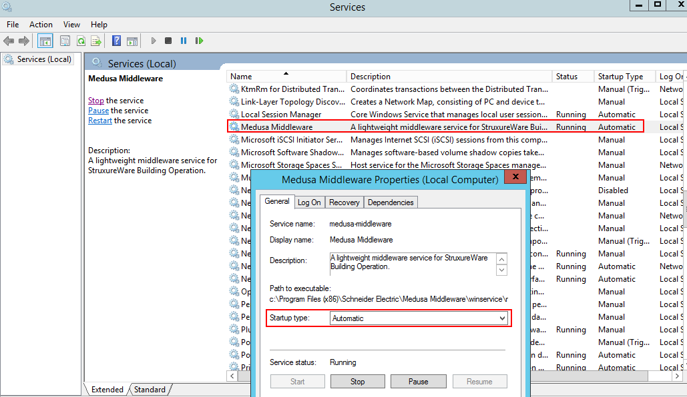
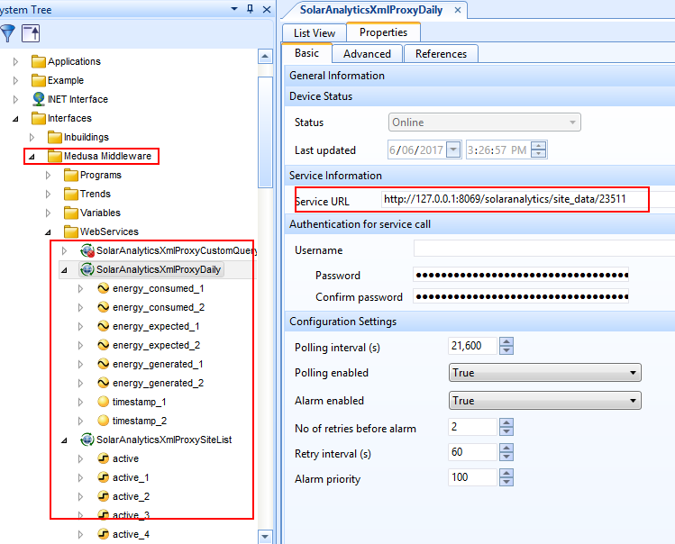

# Medusa Middleware
A lightweight middleware service for StruxureWare Building Operation.

Medusa Middleware is a helper middleware web service for transforming data from unsupported protocols and data formats (eg JSON) into an easily accessible XML Web Service for StruxureWare Building Operation. Medusa Middleware can be used to allow StruxureWare Building Operation and SmartStruxure Servers to consume and serve data to 3rd party om-premise or cloud based services.

## Architecture


## Source
Feel free to clone a copy of the repo and tailor to your needs.

- Runs on a [waitress web server](http://docs.pylonsproject.org/projects/waitress/en/latest/).
- Serves XML Web API Service to StruxureWare using [Falcon Framework](https://falconframework.org/).
- Retrieves 3rd party data for transformation using [requests](http://docs.python-requests.org/en/master/).
- Compiled to exe/msi installer using [cx_Freeze]().
- Installed as a Windows Service using [the Non-Sucking Service Manager](http://nssm.cc).

## Installation
1. Download the [Windows installer MSI](dist/Medusa Middleware-0.1-win32.msi).
2. Create ProgramData directories: Navigate to `%programfiles%/Schneider Electric/Medusa Middleware` and execute `app.exe` once to build the `%ProgramData%/Schneider Electric/medusa middleware` directory.
3. Install as Windows Service: Navigate to `%programfiles%/Schneider Electric/Medusa Middleware/winservice` and run `install_service.bat`
4. Create config file: Copy `%programfiles%/Schneider Electric/Medusa Middleware/config.ini` to `%ProgramData%/Schneider Electric/medusa middleware` and edit to suit.
5. Start the service: Open Services `services.msc` and start `Medusa Middleware`.



## Configure config.ini
Open `%programfiles%/Schneider Electric/Medusa Middleware/config.ini`:

```
# config.ini
[Middleware]
host: 127.0.0.1
port: 8069

[Solar Analytics]
base_url: https://portal.solaranalytics.com.au/api/v2/
username: test@example.com
password: Secure password
site_id: 123
```

### Middleware settings
 - host: The host URL to serve on. Can be localhost/127.0.0.1 for local installations on Enterprise Server or FQDN/external address for remote clients.
 - port: The port number to serve on. Make sure the correct firewall rules are set for access from remote clients.

## Configure StruxureWare
1. Open StruxureWare Building Operation WorkStation and login to an Enterprise Server or other SmartStruxure device.
2. Import `%programfiles%/Schneider Electric/Medusa Middleware/struxureware/xxxxxx.xml`
3. Configure and test the XML Web Services are receiving data from Medusa Middleware. Configure associated trends, graphics and programs.



## TODO
 - Support logging
 - Move nssm.exe, install_service.bat into to level winservice dir, remove the src and surplus files
 - Make remove_service.bat
 - Move config.ini to %programfiles%, remove %programdata% dir unecessary.
 - Finish documentation.
 - Generic JSON API
 - OPC interface
 - SNMP interface

## Revision history

### Version 0.1
 - Support for [Solar Analytics Public API](http://docs.solaranalyticsapi.apiary.io/#) (JSON REST API).
 - Serves XML Web Service to StruxureWare. On request makes a request to 3rd party server, transforms response and responds accordingly.
 - Port, url for serving configurable in `config.ini`.
 - 3rd party API credentials configurable in `config.ini`.
