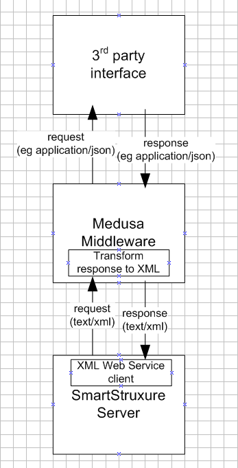
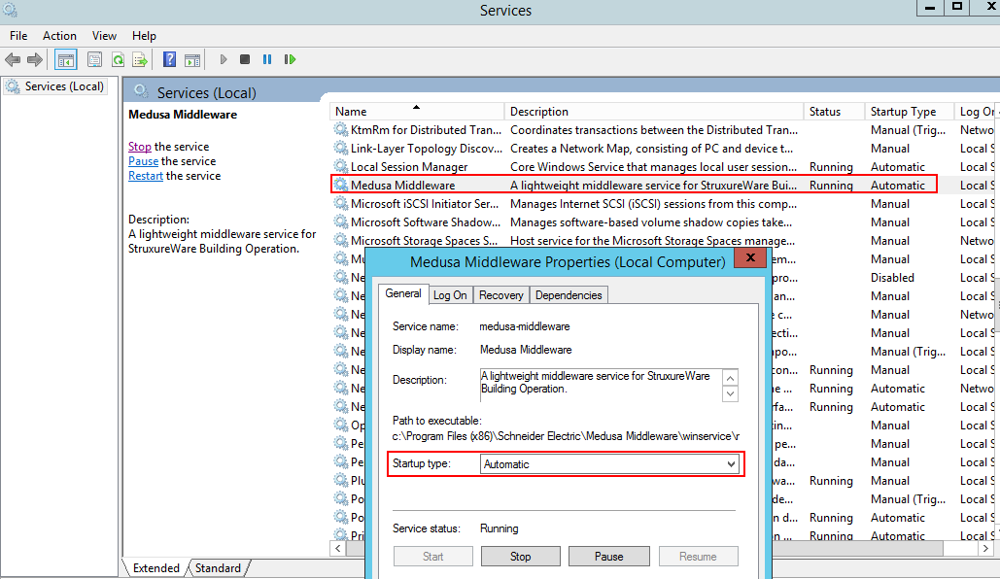
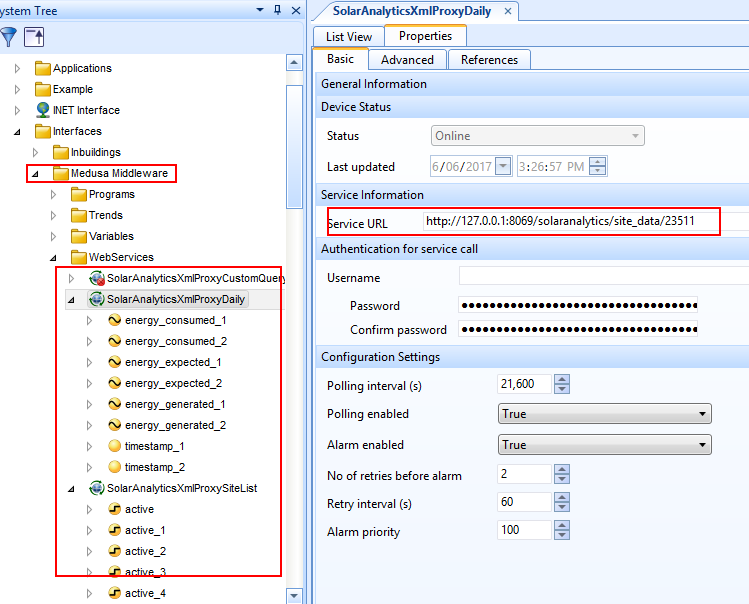

# Medusa Middleware
A lightweight middleware service for StruxureWare Building Operation.

Medusa Middleware is a helper middleware web service for requesting and transforming data from unsupported protocols and data formats (eg HTTP JSON, SNMP trap) into an easily consumable XML web service for StruxureWare Building Operation. Medusa Middleware can be used to allow StruxureWare Building Operation and SmartStruxure Servers to consume (and eventually serve) data from 3rd party services, both on-premise and cloud based.

## Supported interfaces
Current:
 - [Solar Analytics Public API](http://docs.solaranalyticsapi.apiary.io/#): [Click here](interfaces/solaranalytics) for setup instructions.

Planned:
 - [Medusa JSON API](http://medusa-docs.sebbqld.com/)
 - Generic [JSON REST API](https://en.wikipedia.org/wiki/Representational_state_transfer)
 - Generic [OPC](https://en.wikipedia.org/wiki/OPC_Data_Access)
 - Generic [SNMP poll and trap](https://en.wikipedia.org/wiki/Simple_Network_Management_Protocol)

## Architecture


## Contributing
[Click here](contribute) to learn how to contribute.

In a nutshell, Medusa Middleware uses the following technology:
- Developed in [python 3.4](https://www.python.org/). At present, later versions are problematic compiling with cx_Freeze.
- Runs on a [waitress web server](http://docs.pylonsproject.org/projects/waitress/en/latest/).
- Serves XML Web API Service to StruxureWare using [Falcon Framework](https://falconframework.org/).
- Retrieves 3rd party data for transformation using [requests](http://docs.python-requests.org/en/master/).
- Compiled to exe/msi installer using [cx_Freeze](http://cx-freeze.readthedocs.io/en/latest/index.html).
- Installed as a Windows Service using [the Non-Sucking Service Manager](http://nssm.cc).

## Installation
1. Download the [Windows installer MSI](../dist/Medusa Middleware-0.1-win32.msi). Ignore any warnings from the web browser about the file being unsafe.
2. Install as a Windows Service: Navigate to `%programfiles%/Schneider Electric/Medusa Middleware/winservice` and run `install_service_xxx.bat`, based on whether the Windows platform is 32-bit or 64-bit. (This nonsense will be fixed in a later version).
4. Edit config file: see next section.
5. Start the service: Open Services `services.msc` and start `Medusa Middleware`.



## Configure config.ini
Open `%programfiles%/Schneider Electric/Medusa Middleware/config.ini`:

```
# config.ini
[Middleware]
host: 127.0.0.1
port: 8069

[Solar Analytics]
base_url: https://portal.solaranalytics.com.au/api/v2/
username: test@example.com
password: Secure password
site_id: 123
```

Make sure the `Medusa Middleware` service is restarted after any config changes.

### Middleware settings
 - host: The host URL to serve on. Can be localhost/127.0.0.1 for local installations on Enterprise Server or FQDN/external address for remote clients.
 - port: The port number to serve on. Make sure the correct firewall rules are set for access from remote clients.

## Configure StruxureWare
Refer to the Supported interfaces docuemntation link above for interface specific configuration. The basic workflow is as follows:

1. Open StruxureWare Building Operation WorkStation and login to an Enterprise Server or other SmartStruxure device.
2. Import `%programfiles%/Schneider Electric/Medusa Middleware/struxureware/xxxxxx.xml`
3. Configure and test the XML Web Services are receiving data from Medusa Middleware. Configure associated trends, graphics and programs.

Example import of Solar Analytics proxy XML web service interface:


## Uninstall
1. Remove Windows service: Navigate to `%programfiles%/Schneider Electric/Medusa Middleware/winservice` and run `remove_service.bat`.
2. Uninstall `Medus Middleware` using Windows Add or remove programs.

## TODO
 - Merge install_service_xxx.bat files into single batch file that auto detects chipset
 - Execute install_service_xxx.bat during installation instead of manual post install step.
 - Support logging
 - Finish documentation.
 - Generic JSON API
 - OPC interface
 - SNMP interface

## Revision history

### Version 0.1
 - Support for [Solar Analytics Public API](http://docs.solaranalyticsapi.apiary.io/#) (JSON REST API).
 - Serves XML Web Service to StruxureWare. On request makes a request to 3rd party server, transforms response and responds accordingly.
 - Port, url for serving configurable in `config.ini`.
 - 3rd party API credentials configurable in `config.ini`.

### Support or Contact

Having trouble or want to learn more? [contact support](mailto:clive.gross@schneider-electric.com) and we’ll help you sort it out.
